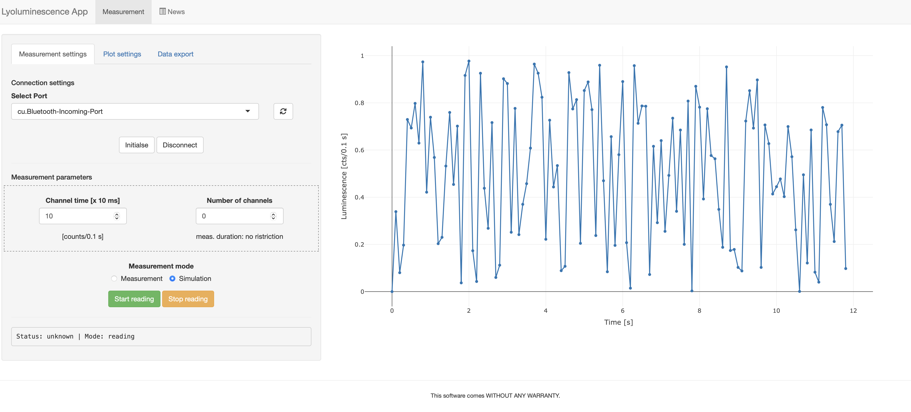

# Lyoluminescence Shiny App

[](https://www.repostatus.org/#active)
[](https://doi.org/10.5281/zenodo.14176467)


A simple graphical user interface to control an Hamamatsu H9319-11 PMT 
for lyoluminescence measurements. 


## Installation

At the moment the package is not on CRAN. An easy way to install it on your
system is via the `devtools` package:

```r
install.packages("devtools")
devtools::install_github("RLumSK/LyoluminescenceApp")
```

This operation needs to be done just once. Note that in both steps you will
be asked to install any required package you may not yet have on your system.
Just agree when prompted and be patient while all dependencies are downloaded
and installed.


## Usage

``` r
# Load the package
library(LyoluminescenceApp)

# Run the app
run_app()
```




# Licence

This program is free software: you can redistribute it and/or modify it under the terms of the [GNU General Public License as published by the Free Software Foundation, either version 3](https://github.com/RLumSK/LyoluminescenceApp/blob/main/LICENSE) of the License, or any later version.

This program is distributed in the hope that it will be useful, but WITHOUT ANY WARRANTY; without even the implied warranty of MERCHANTABILITY or FITNESS FOR A PARTICULAR PURPOSE. See the GNU General Public License for more details.

# Funding

* Sebastian Kreutzer received funding through the DFG Heisenberg programme ([#505822867](https://gepris.dfg.de/gepris/projekt/505822867))

* Marco Colombo is supported through the DFG Programme REPLAY ([#528704761](https://gepris.dfg.de/gepris/projekt/528704761))

* The development of this app was supported by the European Union’s Horizon Europe research and innovation programme under the Marie Skłodowska-Curie grant agreement No [101107989 (Lyoluminescence)](https://cordis.europa.eu/project/id/101107989).
